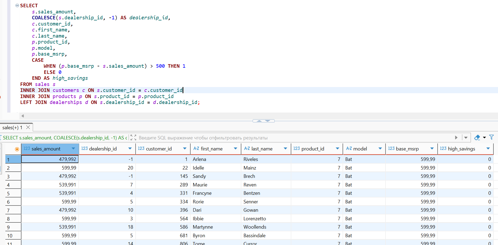
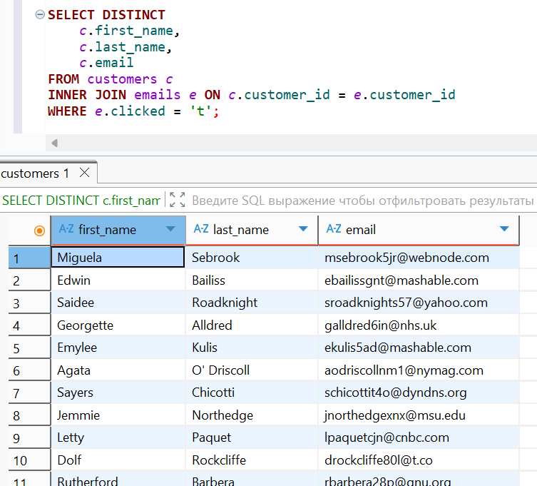
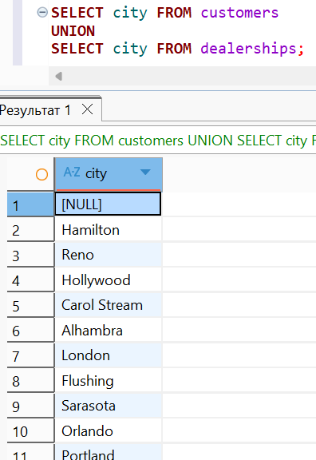
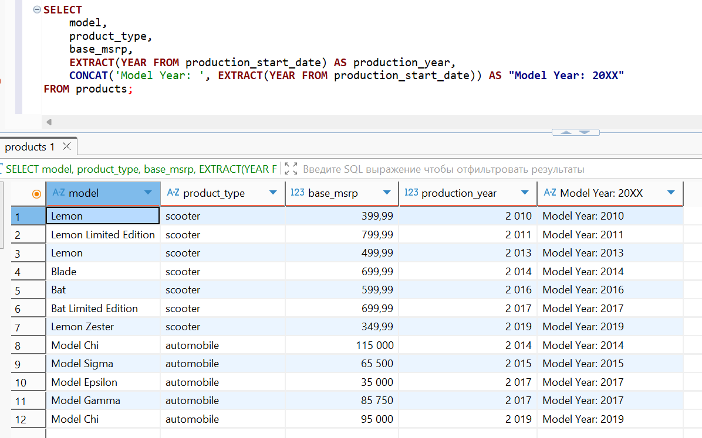

# 🐘 Лабораторная работа №2 🐘
## 🧪 Вариант 9 🧪

👩‍🎓 **Студент:** Еськова Маргарита Ивановна  
👥 **Группа:** ЦИБ-241  

---

## 🔍 Цель работы

Освоить методы объединения таблиц (JOIN, UNION), работу с подзапросами и функции преобразования данных (CASE, COALESCE) в PostgreSQL.

---

## 🛠️ Среда выполнения

Все задания выполнялись в **базе данных преподавателя** (`bi_sql_data_student`) на **домашнем компьютере** через DBeaver.  
Права только на чтение (`SELECT`), что полностью соответствует требованиям задач.

---

## 📦 Подготовка к выполнению заданий

### Проверка подключения к базе данных преподавателя

Перед выполнением запросов было проверено подключение к базе данных преподавателя `bi_sql_data_student` через DBeaver.

1. В DBeaver выбрано подключение `bi_sql_data_student`
2. Зашли в "Настройки соединения"
3. Нажата кнопка **"Test Connection"**

**Результат проверки подключения:**


✅ Подключение успешно, можно выполнять запросы. ✅

---

## 📝 Часть 1. Общие задания (Guided Labs)

### 🚗 Задание 1.1. Поиск покупателей авто (INNER JOIN)

**Задание:** получить контактные данные всех клиентов, купивших автомобиль, для обзвона.

**Требования:**
- Использовать таблицы `sales`, `customers`, `products`
- `product_type = 'automobile'`
- `phone IS NOT NULL`
- Вывести: `customer_id`, `first_name`, `last_name`, `phone`

**Решение:**
```sql
SELECT
    c.customer_id,
    c.first_name,
    c.last_name,
    c.phone
FROM sales s
INNER JOIN customers c ON s.customer_id = c.customer_id
INNER JOIN products p ON s.product_id = p.product_id
WHERE p.product_type = 'automobile'
  AND c.phone IS NOT NULL;
```
**Результат:**


**Пояснение:** Использован `INNER JOIN`, так как нужны только клиенты, у которых есть и продажа, и телефон, и товар — автомобиль.

---

### 🎉 Задание 1.2. Вечеринка в Лос-Анджелесе (UNION)

**Бизнес-задача:** Составить список приглашённых на мероприятие (клиенты + сотрудники из Лос-Анджелеса).

**Требования:**
- Клиенты из `city = 'Los Angeles'`
- Продавцы, работающие в дилерских центрах в `city = 'Los Angeles'`
- Добавить поле `guest_type` ('Customer' или 'Employee')
- Использовать `UNION`

**Решение:**
```sql
SELECT
    first_name,
    last_name,
    'Customer' AS guest_type
FROM customers
WHERE city = 'Los Angeles'

UNION

SELECT sp.first_name, sp.last_name, 'Employee' AS guest_type
FROM salespeople sp
INNER JOIN dealerships d ON sp.dealership_id = d.dealership_id
WHERE d.city = 'Los Angeles';
```

**Результат:**


**Пояснение:** `UNION` удаляет дубликаты. `INNER JOIN` с `dealerships` нужен, чтобы найти сотрудников конкретного дилерского центра.

---

### 📊 Задание 1.3. Создание витрины данных (Data Transformation)

**Задание:** Подготовить "плоскую" таблицу для аналитиков.

**Требования:**
- Соединить `sales` (основа), `customers`, `products`, `dealerships` (LEFT JOIN)
- Если `dealership_id` в продажах `NULL` → заменить на `-1` (`COALESCE`)
- Создать столбец `high_savings`: 1, если `(base_msrp - sales_amount) > 500`, иначе 0

**Решение:**
```sql
SELECT 
    s.sales_amount,
    COALESCE(s.dealership_id, -1) AS dealership_id,
    c.customer_id,
    c.first_name,
    c.last_name,
    p.product_id,
    p.model,
    p.base_msrp,
    CASE 
        WHEN (p.base_msrp - s.sales_amount) > 500 THEN 1
        ELSE 0
    END AS high_savings
FROM sales s
INNER JOIN customers c ON s.customer_id = c.customer_id
INNER JOIN products p ON s.product_id = p.product_id
LEFT JOIN dealerships d ON s.dealership_id = d.dealership_id;
```

**Результат:**



**Пояснение:** `LEFT JOIN` сохранены продажи без дилера. `COALESCE` заменяет `NULL` на `-1`. `CASE` создаёт бинарный признак высокой экономии.

---

## 🎯 Часть 2. Индивидуальные задания (вариант 9)

### ✉️ Задача 1 (JOIN). Клиенты, кликнувшие по ссылке в письме

**Задание:** Вывести имена клиентов, которые кликнули (`clicked = 't'`) по ссылке в письме.

**Решение:**
```sql
SELECT DISTINCT
    c.first_name,
    c.last_name,
    c.email
FROM customers c
INNER JOIN emails e ON c.customer_id = e.customer_id
WHERE e.clicked = 't';
```

**Результат:**



**Пояснение:** Использован `INNER JOIN`, чтобы получить только клиентов, совершивших клик. `DISTINCT` исключает дубликаты, если один клиент кликнул по нескольким письмам.

---

### 🏙️ Задача 2 (UNION). Список городов дилеров и клиентов

**Задание:** Вывести уникальные города из таблиц `customers` и `dealerships`.

**Решение:**
```sql
SELECT city FROM customers
UNION
SELECT city FROM dealerships;
```

**Результат:**



**Пояснение:** `UNION` автоматически удаляет дубликаты. Города из двух источников объединяются в один список.

---

### 📅 Задача 3 (Data Prep). Преобразование года выпуска в текстовый формат

**Задание:** В таблице `products` привести год (`production_start_date`) к текстовому формату и создать столбец `"Model Year: 20XX"`.

**Решение:**
```sql
SELECT 
    model,
    product_type,
    base_msrp,
    EXTRACT(YEAR FROM production_start_date) AS production_year,
    CONCAT('Model Year: ', EXTRACT(YEAR FROM production_start_date)) AS "Model Year: 20XX"
FROM products;
```

**Результат:**



**Пояснение:** `EXTRACT(YEAR FROM date)` извлекает год из даты. `CONCAT` собирает строку. Псевдоним в кавычках сохраняет пробелы в имени столбца.

---

## 📌 Вывод

В ходе лабораторной работы были освоены:
- ✅ `INNER JOIN` для объединения таблиц по ключам
- ✅ `UNION` для вертикального объединения наборов данных
- ✅ `LEFT JOIN` для сохранения всех записей из левой таблицы
- ✅ `COALESCE` для замены `NULL` значениями по умолчанию
- ✅ `CASE` для условной логики
- ✅ `EXTRACT` и `CONCAT` для преобразования данных

---

## 🔗 Ссылки и ресурсы

| Ресурс | Описание | Ссылка |
|--------|----------|--------|
| 📚 **Репозиторий GitHub** | Все материалы лабораторной работы | [`practicum-sql`](https://github.com/Margarita-Eskova/practicum-sql) |
| 💾 **SQL-запросы** | Все запросы в одном файле | [`lab_02/sql`](https://github.com/Margarita-Eskova/practicum-sql/blob/main/lab_02/sql) |
| 📸 **Папка со скриншотами** | Скриншоты результатов | [`lab_02/screenshots/`](https://github.com/Margarita-Eskova/practicum-sql/tree/main/lab_02/screenshots) |

---
