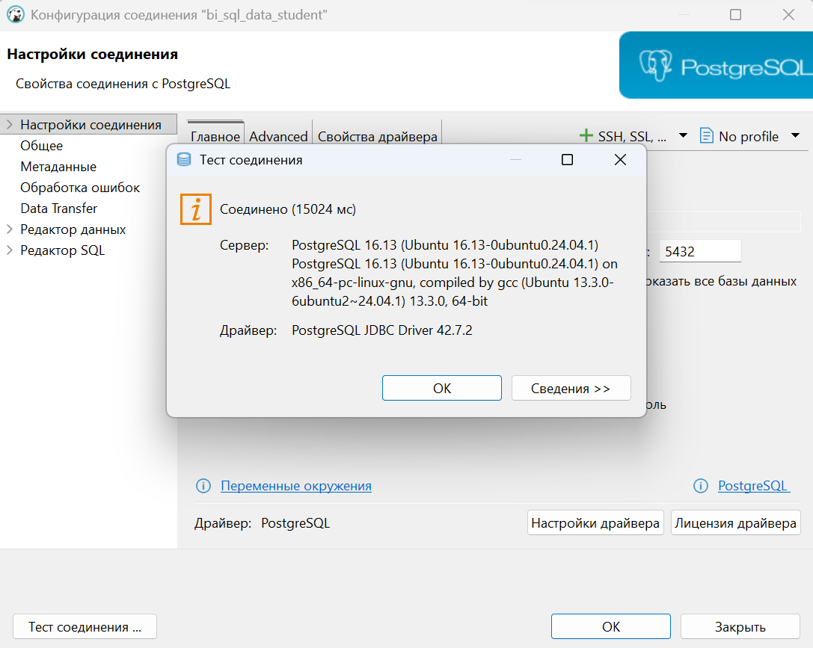
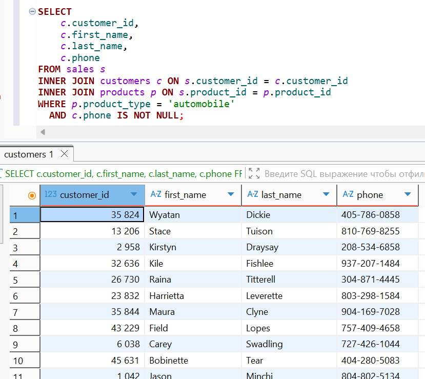
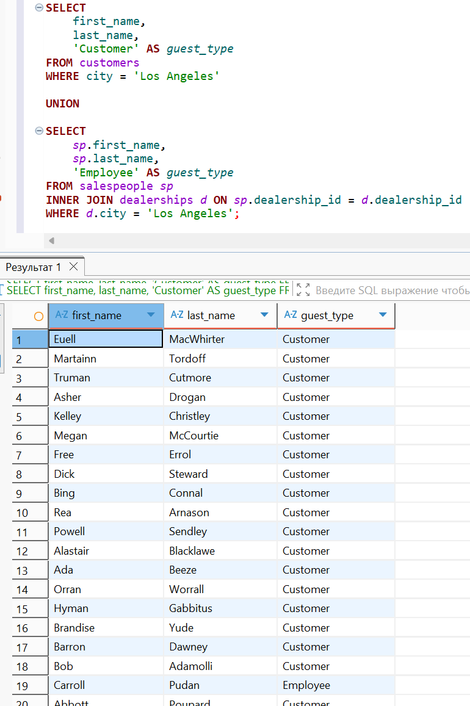

# 🐘 Лабораторная работа №2 🐘
## 🧪 Вариант 9 🧪

👩‍🎓 **Студент:** Еськова Маргарита Ивановна  
👥 **Группа:** ЦИБ-241  

---

## 🔍 Цель работы

Освоить методы объединения таблиц (JOIN, UNION), работу с подзапросами и функции преобразования данных (CASE, COALESCE) в PostgreSQL.

---

## 🛠️ Среда выполнения

Все задания выполнялись в **базе данных преподавателя** (`bi_sql_data_student`) на **домашнем компьютере** через DBeaver.  
Права только на чтение (`SELECT`), что полностью соответствует требованиям задач.

---

## 📦 Подготовка к выполнению заданий

### Проверка подключения к базе данных преподавателя

Перед выполнением запросов было проверено подключение к базе данных преподавателя `bi_sql_data_student` через DBeaver.

1. В DBeaver выбрано подключение `bi_sql_data_student`
2. Нажата кнопка **"Test Connection"**

**Результат проверки подключения:**



Подключение успешно, можно выполнять запросы.

---

## 📝 Часть 1. Общие задания (Guided Labs)

### Задание 1.1. Поиск покупателей авто (INNER JOIN)

**Задание:** получить контактные данные всех клиентов, купивших автомобиль, для обзвона.

**Требования:**
- Использовать таблицы `sales`, `customers`, `products`
- `product_type = 'automobile'`
- `phone IS NOT NULL`
- Вывести: `customer_id`, `first_name`, `last_name`, `phone`

**Решение:**
```sql
SELECT
    c.customer_id,
    c.first_name,
    c.last_name,
    c.phone
FROM sales s
INNER JOIN customers c ON s.customer_id = c.customer_id
INNER JOIN products p ON s.product_id = p.product_id
WHERE p.product_type = 'automobile'
  AND c.phone IS NOT NULL;
```
**Результат::**




**Пояснение:** Использован `INNER JOIN`, так как нужны только клиенты, у которых есть и продажа, и телефон, и товар — автомобиль.

---

### Задание 1.2. Вечеринка в Лос-Анджелесе (UNION)

**Бизнес-задача:** Составить список приглашённых на мероприятие (клиенты + сотрудники из Лос-Анджелеса).

**Требования:**
- Клиенты из `city = 'Los Angeles'`
- Продавцы, работающие в дилерских центрах в `city = 'Los Angeles'`
- Добавить поле `guest_type` ('Customer' или 'Employee')
- Использовать `UNION`

**Решение:**
```sql
SELECT first_name, last_name, 'Customer' AS guest_type
FROM customers
WHERE city = 'Los Angeles'

UNION

SELECT sp.first_name, sp.last_name, 'Employee' AS guest_type
FROM salespeople sp
INNER JOIN dealerships d ON sp.dealership_id = d.dealership_id
WHERE d.city = 'Los Angeles';
```

**Результат::**


