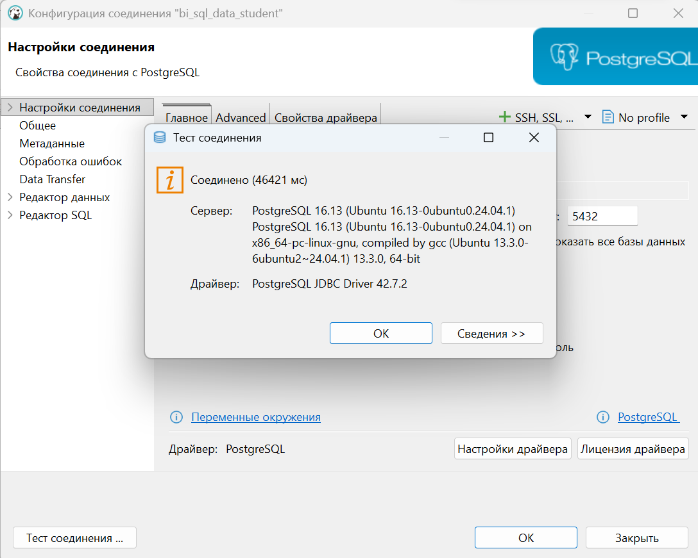
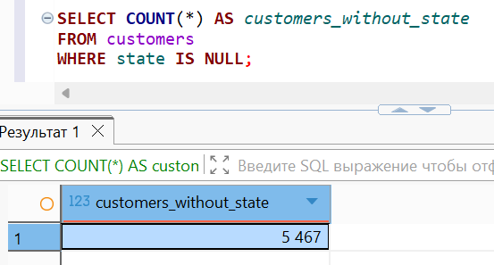
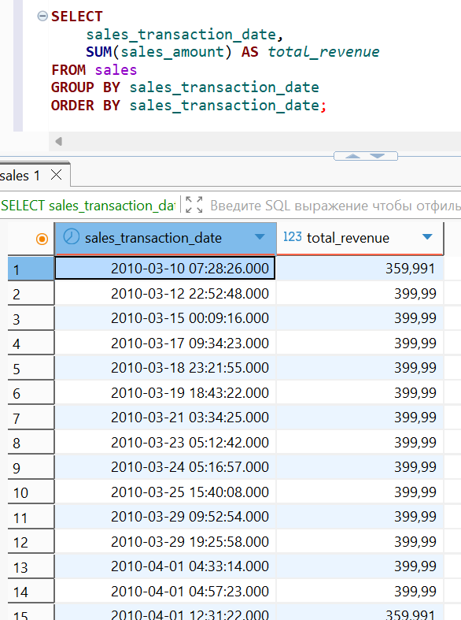
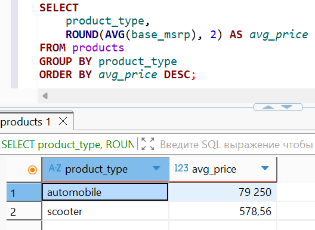

# 🐘 Лабораторная работа №3 🐘
## ✨ Вариант 9 ✨

👩‍🎓 **Студент:** Еськова Маргарита Ивановна  
👥 **Группа:** ЦИБ-241  

---

## 🔍 Цель работы

Научиться выполнять быстрый и эффективный анализ данных, используя возможности агрегирования SQL. Освоить синтаксис группировки данных, фильтрации групп и вычисления статистических показателей.

---

## 🛠️ Среда выполнения

Все задания выполнялись в **базе данных преподавателя** (`bi_sql_data_student`) на **домашнем компьютере** через DBeaver.  
Права только на чтение (`SELECT`), что полностью соответствует требованиям задач.

---

## 📦 Подготовка к выполнению заданий

### ✅ Проверка подключения к базе данных преподавателя

Перед выполнением запросов было проверено подключение к базе данных преподавателя `bi_sql_data_student` через DBeaver.

1. В DBeaver выбрано подключение `bi_sql_data_student`
2. Зашли в **"Настройки соединения"**
3. Нажата кнопка **"Test Connection"**

**Результат проверки подключения:**



Подключение успешно, можно выполнять запросы.

---

## 📝 Часть 1. Индивидуальные задания (вариант 9)

### 🔢 Задание 1. Количество клиентов без указанного штата (state IS NULL)

**Задание:** Посчитать количество клиентов, у которых в таблице `customers` поле `state` не заполнено (`NULL`).

**Решение:**
```sql
SELECT COUNT(*) AS customers_without_state
FROM customers
WHERE state IS NULL;
```

**Результат:**



**Пояснение:** Использована агрегатная функция `COUNT(*)`, которая считает количество строк, удовлетворяющих условию `state IS NULL`. Результат показывает число клиентов, у которых отсутствует информация о штате.

---

### 💰 Задание 2. Суммарная выручка по каждой дате продажи

**Задание:** Вычислить суммарную выручку (`sales_amount`) для каждой даты продажи (`sales_transaction_date`), отсортировать по дате.

**Решение:**
```sql
SELECT 
    sales_transaction_date,
    SUM(sales_amount) AS total_revenue
FROM sales
GROUP BY sales_transaction_date
ORDER BY sales_transaction_date;
```
**Результат:**



**Пояснение:**

- `GROUP BY sales_transaction_date` группирует продажи по дням

- `SUM(sales_amount)` вычисляет общую выручку за каждый день

- `ORDER BY` сортирует результат по дате


## 📊 Задание 3. Типы продуктов со средней ценой от 500 до 5000

**Задание:** Найти типы продуктов (`product_type`), у которых средняя цена (`base_msrp`) находится в диапазоне от 500 до 5000 включительно.

### 🔍 Подготовка: анализ всех типов продуктов (без фильтрации)

Перед выполнением основного запроса полезно посмотреть, какие типы продуктов существуют и какова их средняя цена без ограничений. Это поможет понять, почему в результат попадут только определённые типы.

```sql
SELECT 
    product_type,
    ROUND(AVG(base_msrp), 2) AS avg_price
FROM products
GROUP BY product_type
ORDER BY avg_price DESC;
```

**Результат:**



