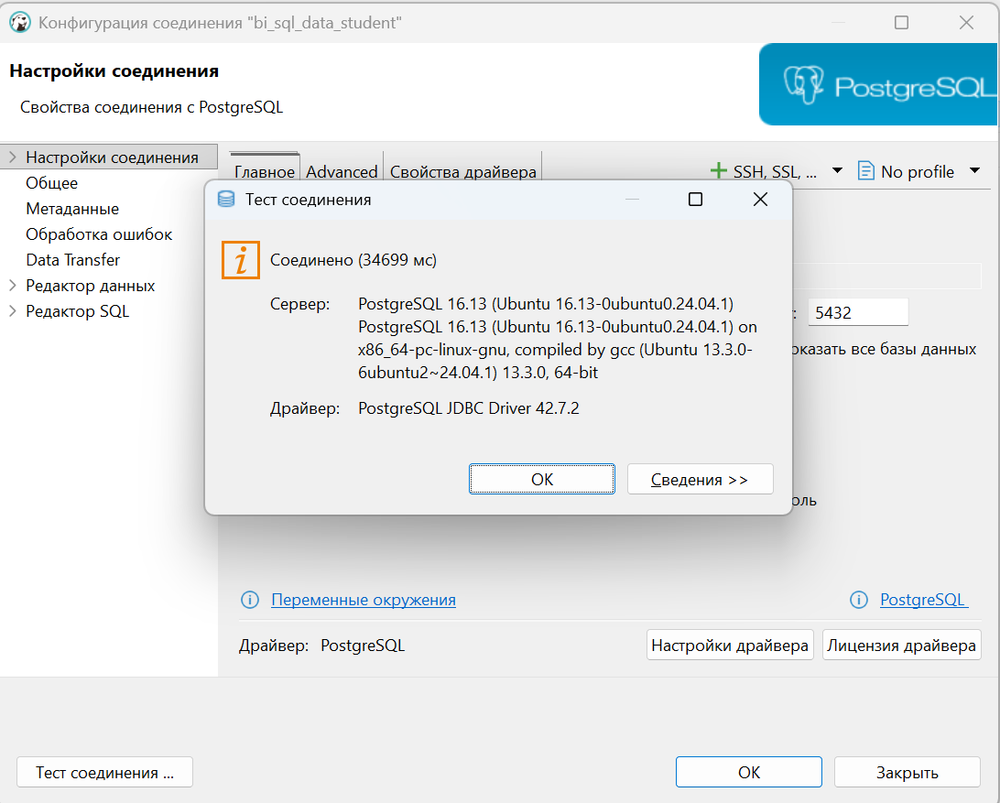

# 🐘 Лабораторная работа №4 🐘
## 🤔 Вариант 9 🤔

👩‍🎓 **Студент:** Еськова Маргарита Ивановна  
👥 **Группа:** ЦИБ-241  

---

## 🔍 Цель работы

Изучить концепцию оконных функций в SQL и научиться применять их для выполнения сложных аналитических расчетов: ранжирования, вычисления скользящих средних, нарастающих итогов и сравнительного анализа строк без группировки данных.

---

## 🛠️ Среда выполнения

Все задания выполнялись в **базе данных преподавателя** (`bi_sql_data_student`) на **домашнем компьютере** через DBeaver.  
Права только на чтение (`SELECT`), что полностью соответствует требованиям задач.

---

## 📦 Подготовка к выполнению заданий

### ✅ Проверка подключения к базе данных преподавателя

Перед выполнением запросов было проверено подключение к базе данных преподавателя `bi_sql_data_student` через DBeaver.

1. В DBeaver выбрано подключение `bi_sql_data_student`
2. Зашли в **"Настройки соединения"**
3. Нажата кнопка **"Test Connection"**

**Результат проверки подключения:**



Подключение успешно, можно выполнять запросы.

---

## 📝 Индивидуальные задания (вариант 9)

### 🏆 Задание 1. Ранжирование продаж по сумме внутри каждого канала (channel)

**Задание:** Ранжировать продажи (`sales`) по сумме (`sales_amount`) внутри каждого канала (`channel`). Использовать `RANK()`.

**Решение:**
```sql
SELECT 
    product_id,
    channel,
    sales_amount,
    RANK() OVER (PARTITION BY channel ORDER BY sales_amount DESC) AS rank_in_channel
FROM sales
ORDER BY channel, rank_in_channel;
```
