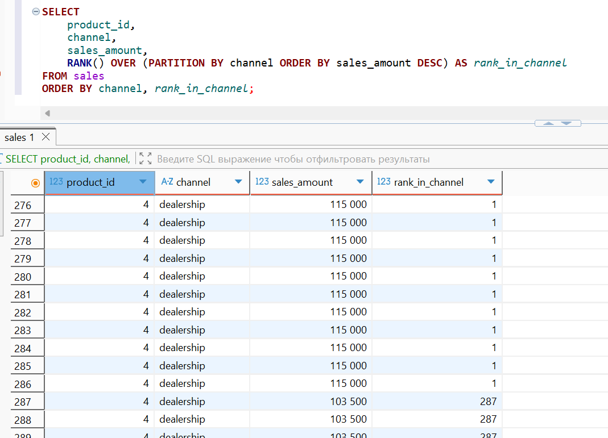
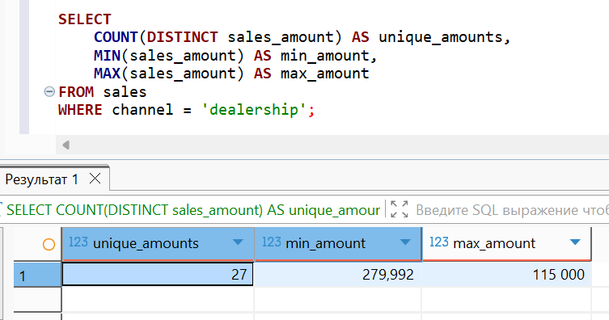
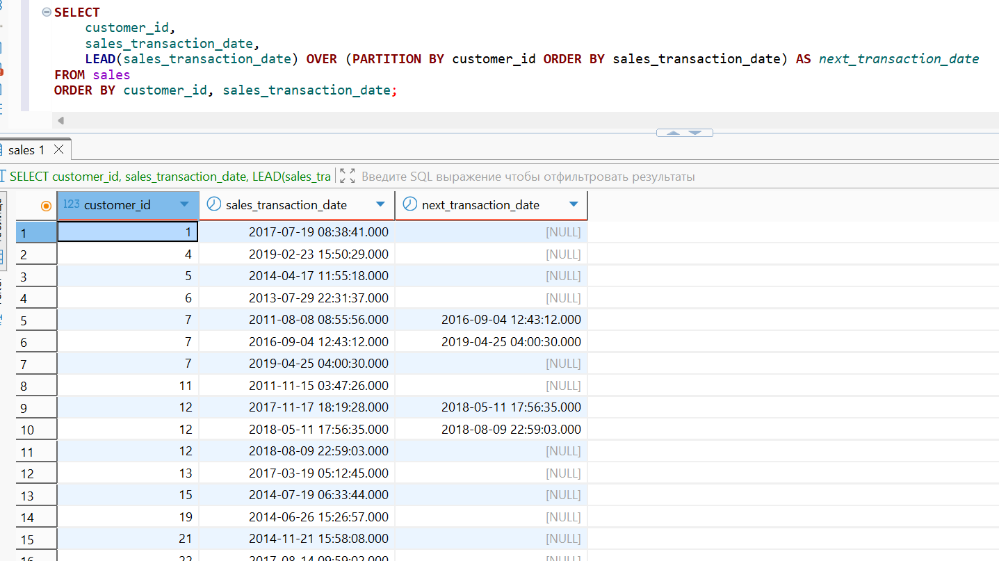
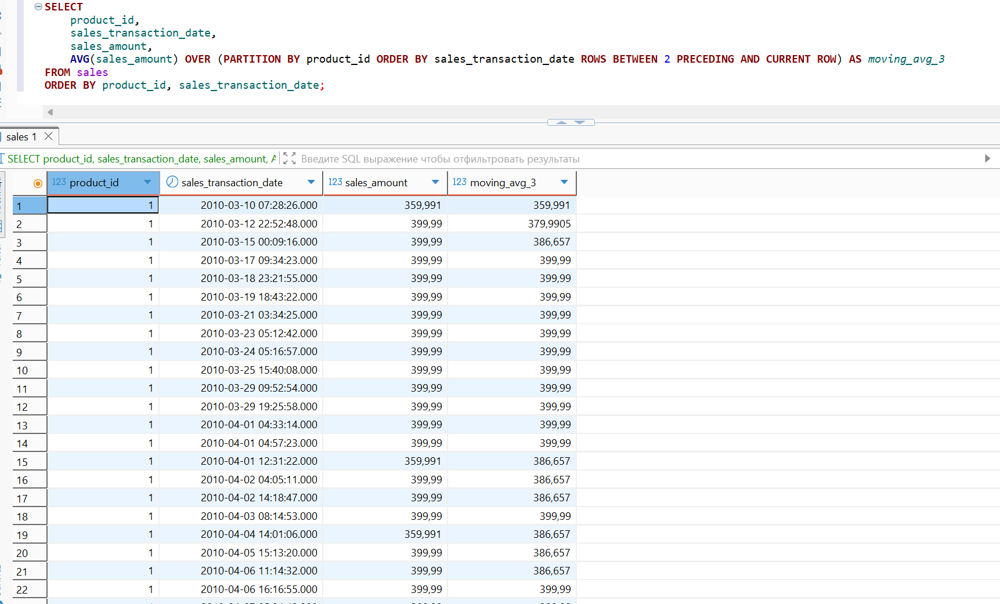

# 🐘 Лабораторная работа №4 🐘
## 🤔 Вариант 9 🤔

👩‍🎓 **Студент:** Еськова Маргарита Ивановна  
👥 **Группа:** ЦИБ-241  

---
## 🪟 Оконные функции для анализа данных
## 🔍 Цель работы

Изучить концепцию оконных функций в SQL и научиться применять их для выполнения сложных аналитических расчетов: ранжирования, вычисления скользящих средних, нарастающих итогов и сравнительного анализа строк без группировки данных.

---

## 🛠️ Среда выполнения

Все задания выполнялись в **базе данных преподавателя** (`bi_sql_data_student`) на **домашнем компьютере** через DBeaver.  
Права только на чтение (`SELECT`), что полностью соответствует требованиям задач.

---

## 📦 Подготовка к выполнению заданий

### ✅ Проверка подключения к базе данных преподавателя

Перед выполнением запросов было проверено подключение к базе данных преподавателя `bi_sql_data_student` через DBeaver.

1. В DBeaver выбрано подключение `bi_sql_data_student`
2. Зашли в **"Настройки соединения"**
3. Нажата кнопка **"Test Connection"**

**Результат проверки подключения:**


Подключение успешно, можно выполнять запросы.

---

## 📝 Индивидуальные задания (вариант 9)

### 🏆 Задание 1. Ранжирование продаж по сумме внутри каждого канала (channel)

**Задание:** Ранжировать продажи (`sales`) по сумме (`sales_amount`) внутри каждого канала (`channel`). Использовать `RANK()`.

**Решение:**
```sql
SELECT 
    product_id,
    channel,
    sales_amount,
    RANK() OVER (PARTITION BY channel ORDER BY sales_amount DESC) AS rank_in_channel
FROM sales
ORDER BY channel, rank_in_channel;
```

**Результат:**



**Пояснение:**  
- `PARTITION BY channel` делит продажи по каналам  
- `ORDER BY sales_amount DESC` сортирует продажи от большей суммы к меньшей  
- `RANK()` присваивает ранг: одинаковые суммы получают одинаковый ранг, следующий ранг пропускается

**Анализ:**  
В таблице `sales` все продажи относятся к каналу `dealership`. Первые строки имеют сумму `115 000` (ранг 1), затем появляются суммы `103 500` (ранг 287 и выше). Это демонстрирует корректную работу `RANK()`: одинаковые значения получают одинаковый ранг.

---

#### 🔍 Проверочный запрос (демонстрация `RANK()` на данных с разными значениями)

Чтобы показать, что `RANK()` работает корректно на данных с разными значениями, выполним запрос на таблице `products`:

```sql
SELECT 
    COUNT(DISTINCT sales_amount) AS unique_amounts,
    MIN(sales_amount) AS min_amount,
    MAX(sales_amount) AS max_amount
FROM sales
WHERE channel = 'dealership';
```

**Результат:**



**Анализ проверочного запроса:**  
- `unique_amounts` — количество уникальных сумм в канале `dealership`  
- `min_amount` — минимальная сумма продажи  
- `max_amount` — максимальная сумма продажи  

Этот запрос подтверждает, что в канале `dealership` присутствуют разные суммы продаж, а не только `115 000`. Таким образом, функция `RANK()` корректно распределяет ранги: максимальная сумма (`115 000`) получает ранг 1, а меньшие суммы — более высокие ранги (например, `103 500` → ранг 287). Это доказывает правильность работы `RANK()` на данных с разными значениями.

---

### ⏱️ Задание 2. Дата следующей транзакции для каждого клиента

**Задание:** Для каждого клиента вывести дату текущей и следующей продажи. Использовать `LEAD()`.

**Решение:**
```sql
SELECT 
    customer_id,
    sales_transaction_date,
    LEAD(sales_transaction_date) OVER (PARTITION BY customer_id ORDER BY sales_transaction_date) AS next_transaction_date
FROM sales
ORDER BY customer_id, sales_transaction_date;
```
**Результат:**



**Пояснение:**  
- `PARTITION BY customer_id` группирует продажи по клиентам  
- `ORDER BY sales_transaction_date` сортирует продажи клиента по дате  
- `LEAD(sales_transaction_date)` берёт дату **следующей** продажи этого же клиента  
- Для последней продажи клиента возвращается `NULL`

**Анализ:**  
Например, клиент с `customer_id = 7` совершил три покупки:  
`2011-08-08` → следующая `2016-09-04`;  
`2016-09-04` → следующая `2019-04-25`;  
`2019-04-25` → следующих нет (`NULL`).  

Это позволяет анализировать частоту покупок и время между транзакциями. Для клиентов с единственной покупкой `next_transaction_date` будет `NULL`, что также корректно отражает отсутствие последующих продаж.

---

### 📈 Задание 3. Скользящее среднее продаж (по 3 транзакции) для каждого продукта

**Задание:** Рассчитать скользящее среднее `sales_amount` по 3 транзакциям (текущая + 2 предыдущих) для каждого продукта. Использовать `AVG()` с оконным фреймом.

**Решение:**
```sql
SELECT 
    product_id,
    sales_transaction_date,
    sales_amount,
    AVG(sales_amount) OVER (PARTITION BY product_id ORDER BY sales_transaction_date ROWS BETWEEN 2 PRECEDING AND CURRENT ROW) AS moving_avg_3
FROM sales
ORDER BY product_id, sales_transaction_date;
```
**Результат:**



**Пояснение:**  
- `PARTITION BY product_id` группирует продажи по продуктам  
- `ORDER BY sales_transaction_date` сортирует продажи по дате  
- `ROWS BETWEEN 2 PRECEDING AND CURRENT ROW` задаёт окно: текущая строка и 2 предыдущие  
- `AVG(sales_amount)` вычисляет среднее арифметическое в этом окне  
- Для первых строк (где нет 2 предыдущих) среднее считается по доступным строкам

**Анализ:**  
Скользящее среднее сглаживает колебания и помогает увидеть общий тренд продаж каждого продукта. Например:  
- Для первой продажи продукта `moving_avg_3` равно самой сумме продажи  
- Для второй продажи — среднее арифметическое первой и второй  
- Начиная с третьей продажи — среднее по трём последним продажам  

Это позволяет анализировать динамику продаж и выявлять устойчивые тенденции, исключая случайные всплески или падения.

---

## 📌 Вывод

В ходе лабораторной работы были освоены:

- ✅ Оконные функции: `RANK()`, `LEAD()`, `AVG()` с `OVER()`
- ✅ Разделение на группы с `PARTITION BY`
- ✅ Сортировка внутри окна с `ORDER BY`
- ✅ Оконный фрейм `ROWS BETWEEN ... PRECEDING AND CURRENT ROW`
- ✅ Вычисление скользящего среднего без группировки строк

**Анализ полученных данных:**

1. **Задание 1:** Ранжирование продаж показало, что в канале `dealership` максимальная сумма (`115 000`) имеет ранг 1, а следующие суммы (`103 500`) — ранг 287. Проверочный запрос подтвердил наличие разных сумм в канале.
2. **Задание 2:** `LEAD()` позволил определить для каждого клиента дату следующей покупки. Например, клиент с `id = 7` совершал покупки с интервалами в несколько лет.
3. **Задание 3:** Скользящее среднее по 3 транзакциям сгладило колебания и показало стабильный тренд продаж для каждого продукта.

---

## 🔗 Ссылки и ресурсы

| Ресурс | Описание | Ссылка |
|--------|----------|--------|
| 📚 **Репозиторий GitHub** | Все материалы лабораторной работы | [`practicum-sql`](https://github.com/Margarita-Eskova/practicum-sql) |
| 💾 **SQL-запросы** | Все запросы в одном файле | [`lab_04/sql/lab_04.sql`](https://github.com/Margarita-Eskova/practicum-sql/blob/main/lab_04/sql/lab_04.sql) |
| 📸 **Папка со скриншотами** | Скриншоты результатов | [`lab_04/screenshots/`](https://github.com/Margarita-Eskova/practicum-sql/tree/main/lab_04/screenshots) |

---
