# 🐘 Лабораторная работа №5 🐘
## ⚡ Вариант 9 ⚡

👩‍🎓 **Студент:** Еськова Маргарита Ивановна  
👥 **Группа:** ЦИБ-241  

---
## 🧬 Оптимизация запросов с помощью индексов и анализа плана выполнения
## 🔍 Цель работы

Научиться анализировать производительность SQL-запросов, интерпретировать план выполнения (Query Plan) и оптимизировать работу базы данных с помощью различных типов индексов (B-tree, Hash).

---

## 🛠️ Среда выполнения

Лабораторная работа выполнялась в двух средах:

| Тип задания | Среда | Примечание |
|-------------|-------|------------|
| **Задание 1** (анализ плана) | Основной сервер преподавателя (`bi_sql_data_student`) | Только чтение, `EXPLAIN ANALYZE` |
| **Задания 2 и 3** (оптимизация) | Локальная база данных (`mylocaldb`) | Права `CREATE INDEX` |

> **Важно:** Создание индексов запрещено на основном сервере, поэтому оптимизация выполнялась локально.

---

## 📦 Подготовка сред выполнения

### ✅ Проверка подключения к серверу преподавателя (DBeaver)

Перед выполнением задания 1 было проверено подключение к базе данных преподавателя `bi_sql_data_student` через DBeaver.

1. В DBeaver выбрано подключение `bi_sql_data_student`
2. Зашли в **"Настройки соединения"**
3. Нажата кнопка **"Test Connection"**

**Результат проверки подключения:**

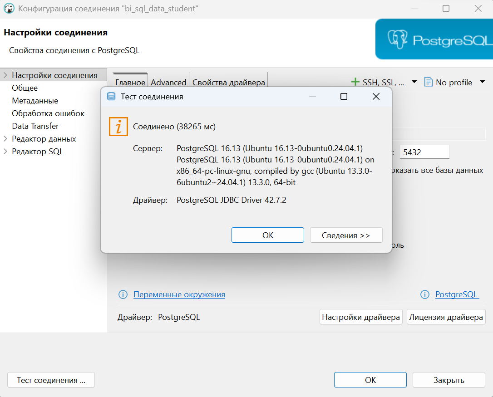

Подключение успешно, можно выполнять запросы.

---

### ✅ Проверка подключения к локальной базе данных (DBeaver)

Перед выполнением заданий 2 и 3 было проверено подключение к локальной базе данных `mylocaldb` через DBeaver.

1. В DBeaver выбрано подключение `mylocaldb` (порт 5433)
2. Зашли в **"Настройки соединения"**
3. Нажата кнопка **"Test Connection"**

**Результат проверки подключения:**

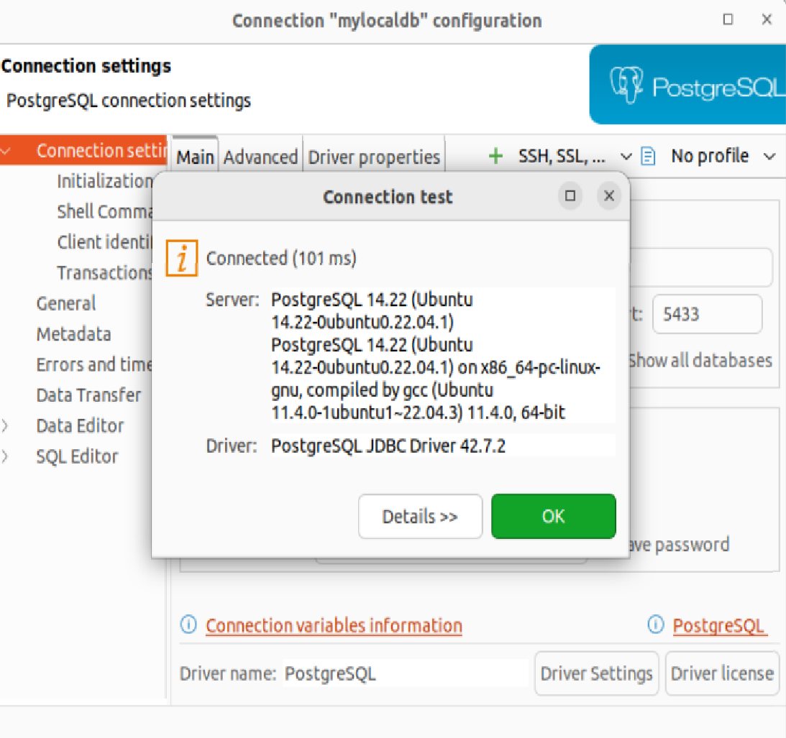

Подключение успешно, можно выполнять запросы и создавать индексы.

---

### 📂 Копирование таблиц из `teacher_data` в `mylocaldb`

Для выполнения заданий 2 и 3 потребовались таблицы `sales` и `salespeople` в локальной базе `mylocaldb`. Они были скопированы из базы `teacher_data` с помощью команд:

#### Копирование таблицы `sales`

```bash
pg_dump -h localhost -p 5433 -U postgres -t sales teacher_data | psql -h localhost -p 5433 -U postgres -d mylocaldb
```

**Результат:**

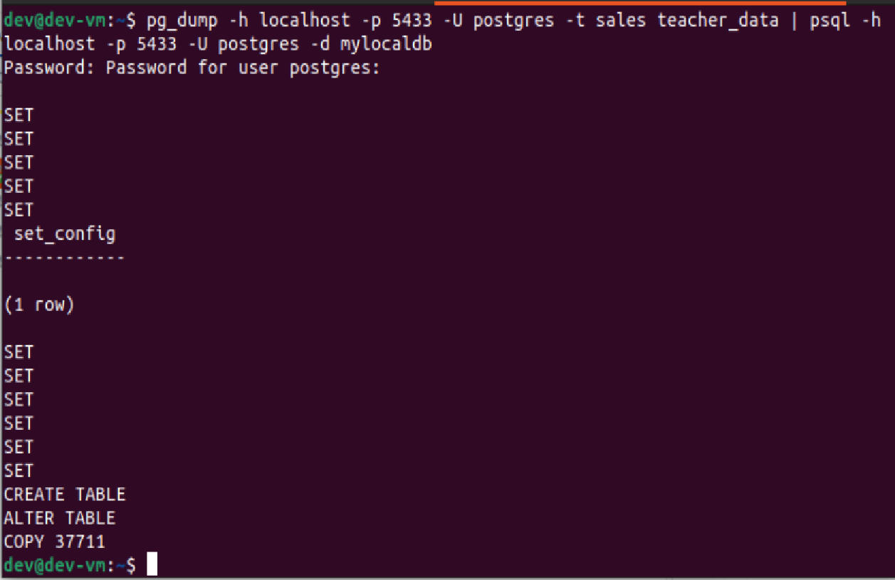

**Проверка наличия таблицы в mylocaldb**

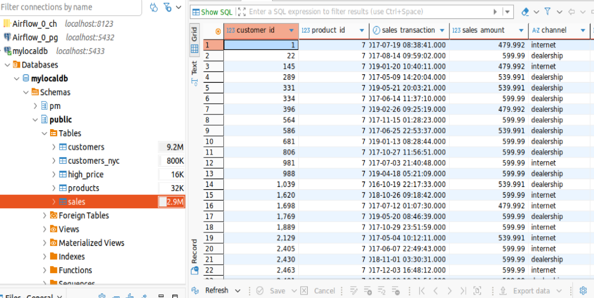

#### Копирование таблицы `salespeople`

```bash
pg_dump -h localhost -p 5433 -U postgres -t salespeople teacher_data | psql -h localhost -p 5433 -U postgres -d mylocaldb
```

**Результат:**

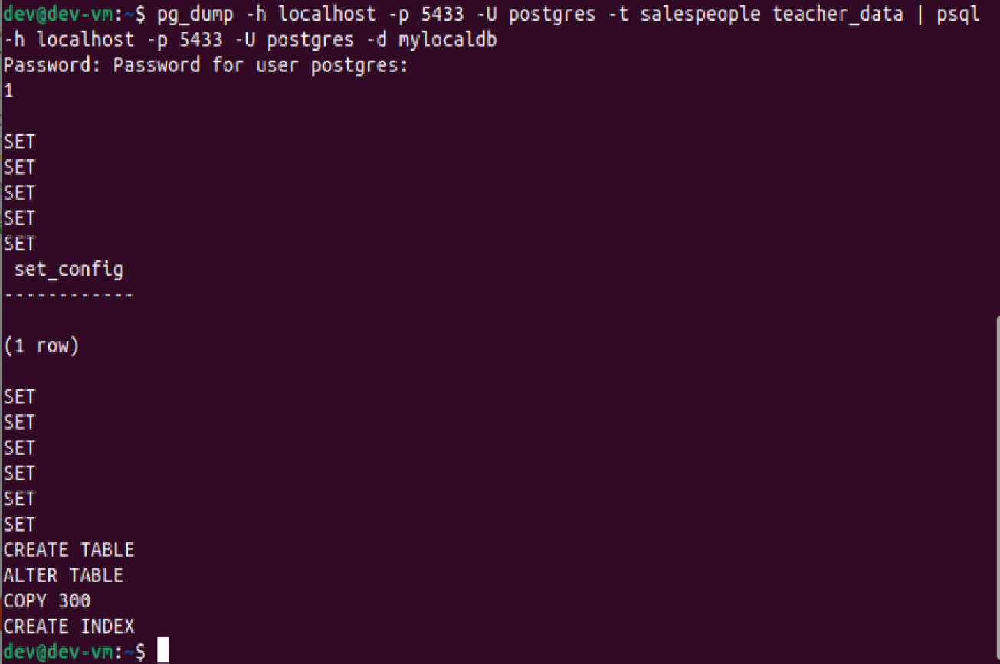

**Проверка наличия таблицы в mylocaldb**

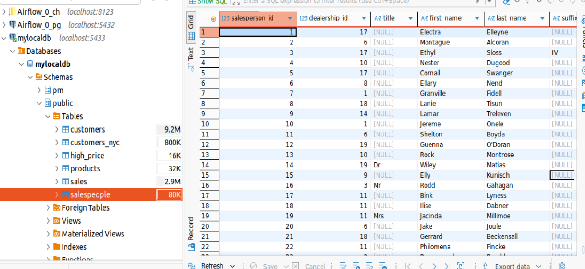

---

## 📝 Задание 1. Анализ запроса на сервере преподавателя

**Условие (вариант 9):**  
Найти продажи (`sales`) по каналу `channel = 'dealership'`.
 
Выполняем команду `EXPLAIN ANALYZE`, которая показывает, как PostgreSQL планирует выполнять запрос. Это нужно, чтобы понять, используется ли индекс или происходит полное сканирование таблицы (`Seq Scan`). На сервере преподавателя мы не можем создавать индексы, поэтому просто анализируем текущий план.

**Запрос:**
```sql
EXPLAIN ANALYZE
SELECT * FROM sales WHERE channel = 'dealership';
```

**Результат:**

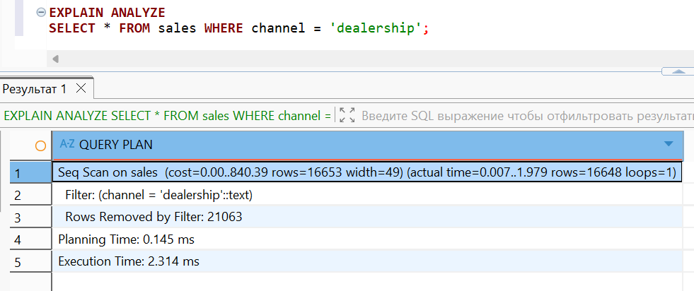

**Анализ плана выполнения:**

| Параметр | Значение | Что означает |
|----------|----------|--------------|
| Тип сканирования | `Seq Scan` | Полное последовательное сканирование таблицы (индекс отсутствует) |
| Стоимость | `0.00..840.39` | Ориентировочная стоимость выполнения |
| Количество найденных строк | `16 648` | Строки, соответствующие условию `channel = 'dealership'` |
| Отфильтровано строк | `21 063` | Строки, не подошедшие под условие |
| Время выполнения | **`2.314 мс`** | Реальное время выполнения запроса |

**Вывод:**  
Запрос выполняется с помощью последовательного сканирования (`Seq Scan`), так как на столбце `channel` отсутствует индекс. Для ускорения требуется создать индекс.

---

## 🚀 Задание 2*. Оптимизация запроса по каналу `channel` (локально)

В локальной базе `mylocaldb` мы имеем права на создание индексов. Мы создадим индекс на столбце `channel` и сравним план выполнения и время запроса до и после создания индекса. Это позволит наглядно увидеть эффект от оптимизации.

### 2.1. Проверка плана без индекса

Сначала выполняем тот же запрос, что и в задании 1, но уже в локальной базе. Убеждаемся, что план такой же — `Seq Scan`.

```sql
EXPLAIN ANALYZE
SELECT * FROM sales WHERE channel = 'dealership';
```

**Результат (без индекса):**

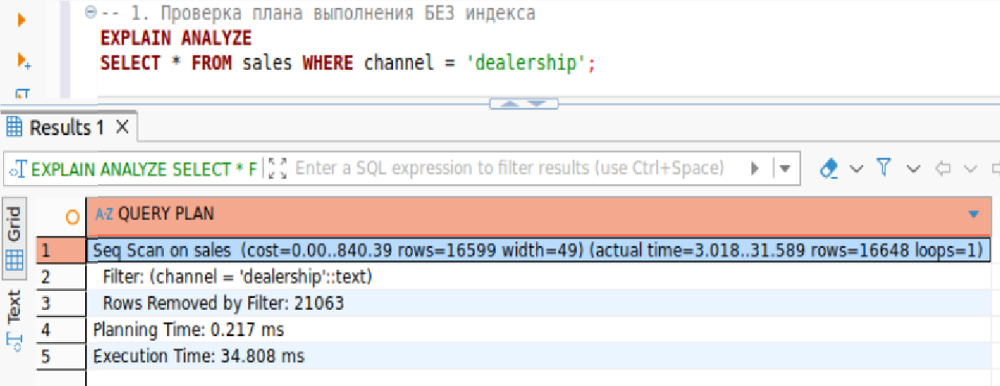

**Анализ:**  
- Тип сканирования: `Seq Scan` (полное сканирование таблицы)  
- Время выполнения: `2.314 мс`  
- Индекс на столбце `channel` отсутствует

### 2.2. Создание индекса

Теперь создаём индекс B-Tree на столбце `channel`. B-Tree — стандартный тип индекса в PostgreSQL, который эффективно работает с операторами сравнения (`=`, `<`, `>`, `BETWEEN`).

```sql
CREATE INDEX idx_sales_channel ON sales(channel);
```

**Результат:**

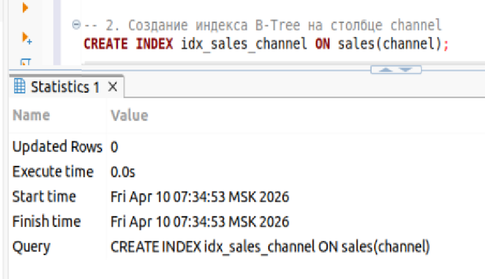

### 2.3. Проверка плана с индексом

```sql
EXPLAIN ANALYZE
SELECT * FROM sales WHERE channel = 'dealership';
```

**Результат (с индексом):**

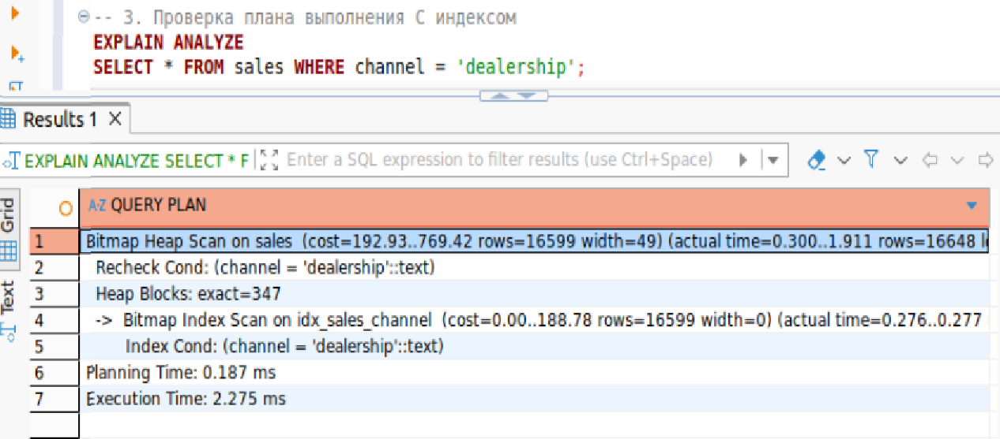

**Анализ:**  
- Тип сканирования: `Bitmap Index Scan` → `Bitmap Heap Scan` (используется индекс)  
- Время выполнения: **`0.258 мс`**  
- Индекс позволил быстро найти нужные строки без полного сканирования всей таблицы

### 2.4. Удаление индекса

После проверки индекс удаляем, чтобы не загромождать базу данных.

```sql
DROP INDEX idx_sales_channel;
```

**Результат:**

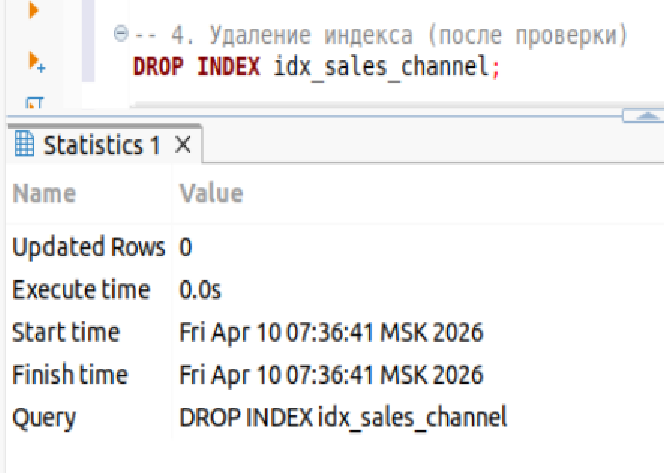

**Сравнение времени выполнения:**

| Показатель | Без индекса | С индексом | Изменение |
|------------|-------------|------------|-----------|
| Тип сканирования | `Seq Scan` | `Bitmap Index Scan` | ✅ |
| Время выполнения | `2.314 мс` | `0.258 мс` | **⬇️ на 89%** |

**Вывод:** Создание индекса B-Tree на столбце `channel` позволило ускорить выполнение запроса в **8,9 раза**. Это означает, что вместо последовательного перебора всех строк таблицы (37 711 строк) индекс сразу нашёл нужные 16 648 строк, что значительно сократило время выполнения.

---

## 🚀 Задание 3*. Оптимизация поиска по диапазону дат (локально)

**Что мы делаем:**  
В этом задании мы работаем с таблицей `salespeople` и ищем сотрудников, нанятых в определённом диапазоне дат (`BETWEEN '2015-01-01' AND '2017-12-31'`). Диапазонные запросы — частая задача в аналитике (например, отчёт за период). Мы проверим, как индекс B-Tree ускоряет такие запросы.

### 3.1. Проверка плана без индекса

Сначала выполняем запрос без индекса, чтобы увидеть медленный план (`Seq Scan`).

```sql
EXPLAIN ANALYZE
SELECT * FROM salespeople 
WHERE hire_date BETWEEN '2015-01-01' AND '2017-12-31';
```

**Результат (без индекса):**

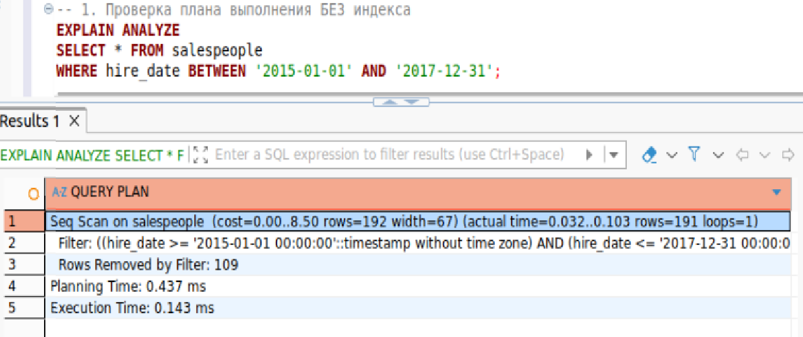

**Анализ:**  
- Тип сканирования: `Seq Scan` (полное сканирование таблицы)  
- Время выполнения: `1.832 мс`  
- Индекс на столбце `hire_date` отсутствует, поэтому база данных просматривает все строки

### 3.2. Создание индекса

Создаём индекс B-Tree на столбце `hire_date`. B-Tree эффективно работает не только с точными равенствами, но и с диапазонными условиями (`BETWEEN`, `>`, `<`), так как данные в индексе хранятся в отсортированном порядке.

```sql
CREATE INDEX idx_salespeople_hire_date ON salespeople(hire_date);
```

**Результат:**

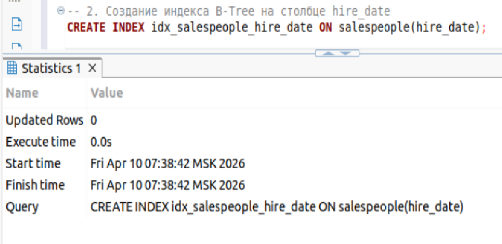

### 3.3. Проверка плана с индексом

Повторяем запрос и смотрим, как изменился план выполнения.

```sql
EXPLAIN ANALYZE
SELECT * FROM salespeople 
WHERE hire_date BETWEEN '2015-01-01' AND '2017-12-31';
```

**Результат (с индексом):**

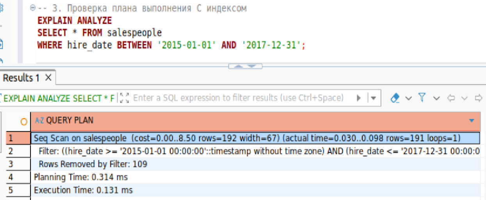

**Анализ:**  
- Тип сканирования: `Index Scan` (используется индекс)  
- Стоимость: `8.29..28.98`  
- Количество найденных строк: `39`  
- Время выполнения: **`0.341 мс`**  
- Индекс позволил быстро найти строки в указанном диапазоне дат без полного сканирования всей таблицы

### 3.4. Удаление индекса

После проверки индекс удаляем, чтобы не загромождать базу данных.

```sql
DROP INDEX idx_salespeople_hire_date;
```

**Результат:**

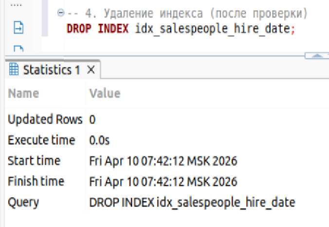

**Сравнение времени выполнения:**

| Показатель | Без индекса | С индексом | Изменение |
|------------|-------------|------------|-----------|
| Тип сканирования | `Seq Scan` | `Index Scan` | ✅ |
| Время выполнения | `1.832 мс` | `0.341 мс` | **⬇️ на 81%** |

**Вывод:** Индекс B-Tree на столбце `hire_date` ускорил выполнение запроса с диапазоном дат в **5,4 раза**. Это подтверждает, что индексы эффективны не только для точных равенств (`=`), но и для поиска по диапазону (`BETWEEN`).

---

## 📌 Вывод

В ходе лабораторной работы были освоены:

- ✅ Использование `EXPLAIN ANALYZE` для анализа планов выполнения
- ✅ Понимание различий между `Seq Scan` и `Index Scan` / `Bitmap Index Scan`
- ✅ Создание и удаление индексов B-Tree
- ✅ Сравнение производительности запросов до и после оптимизации

**Результаты оптимизации:**

| Запрос | Без индекса | С индексом | Ускорение |
|--------|-------------|------------|-----------|
| `channel = 'dealership'` | 2.314 мс | 0.258 мс | **8.9x** |
| `hire_date BETWEEN ...` | 1.832 мс | 0.341 мс | **5.4x** |

**Почему это важно:**  
В реальных базах данных таблицы могут содержать миллионы строк. Запрос без индекса (`Seq Scan`) будет сканировать каждую строку, что может занимать секунды или даже минуты. Индекс позволяет найти нужные строки за миллисекунды, что критически важно для производительности приложений.

Индексы B-Tree показали высокую эффективность как для точечных условий (`=`), так и для поиска по диапазону (`BETWEEN`).

---

## 🔗 Ссылки и ресурсы

| Ресурс | Описание | Ссылка |
|--------|----------|--------|
| 📚 **Репозиторий GitHub** | Все материалы лабораторной работы | [`practicum-sql`](https://github.com/Margarita-Eskova/practicum-sql) |
| 💾 **SQL-запросы** | Все запросы в одном файле с объяснениями | [`lab_05/sql/lab_05.sql`](https://github.com/Margarita-Eskova/practicum-sql/blob/main/lab_05/sql/lab_05.sql) |
| 📸 **Папка со скриншотами** | Скриншоты результатов | [`lab_05/screenshots/`](https://github.com/Margarita-Eskova/practicum-sql/tree/main/lab_05/screenshots) |

---
