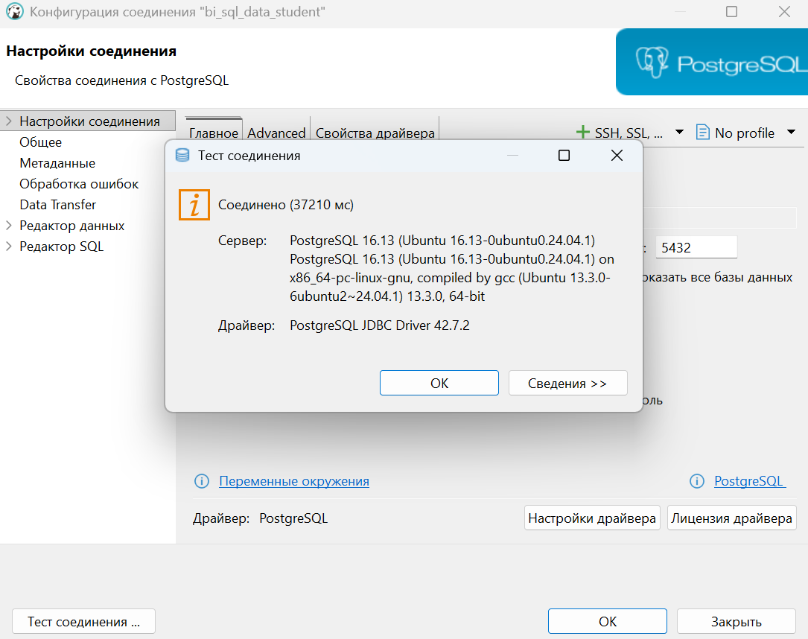
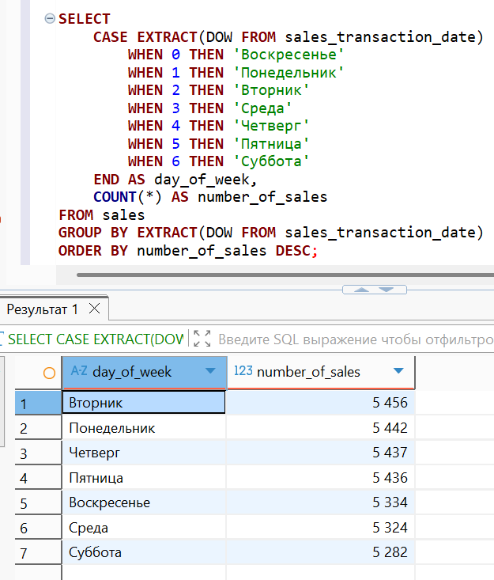

# 🐙 Практическая работа 1 🐙
## 🏁 Продвинутые возможности PostgreSQL 🏁

👩‍🎓 **Студент:** Еськова Маргарита Ивановна  
👥 **Группа:** ЦИБ-241  

---
## 🏠 Геопространственный анализ данных. Аналитика с использованием сложных типов данных.
## 🔍 Цель работы

Научиться применять продвинутые возможности PostgreSQL для анализа данных, выходящих за рамки стандартных чисел и строк. Освоить работу с временными рядами, геопространственными данными, массивами, JSON/JSONB структурами и полнотекстовым поиском.

---

## 🛠️ Среда выполнения

Все задания выполнялись в **базе данных преподавателя** (`bi_sql_data_student`) на **домашнем компьютере** через DBeaver.  
Права только на чтение (`SELECT`), что полностью соответствует требованиям задач.

---

## 📦 Подготовка к выполнению заданий

### ✅ Проверка подключения к базе данных преподавателя

Перед выполнением запросов было проверено подключение к базе данных преподавателя `bi_sql_data_student` через DBeaver.

**Результат проверки подключения:**



Подключение успешно, можно выполнять запросы.

---

## 📝 Выбранные задания

| № | Блок | Задание | Суть |
|---|------|---------|------|
| **1** | А | Дни недели продаж | Определить день недели с наибольшим количеством продаж |
| **3** | А | Квартальный отчет | Сумма продаж по кварталам и годам |
| **11** | В | JSON-история покупок | Сформировать JSON-объект для каждого клиента с его покупками |
| **18** | Г | Категоризация отзывов | Разделить отзывы на категории по ключевым словам |

---

## 📊 Задание 1 (А). Дни недели продаж

**Задача:** Определить, в какой день недели (понедельник, вторник и т.д.) совершается наибольшее количество продаж (`sales`). Вывести день недели и количество транзакций.

**Решение:**
```sql
SELECT 
    CASE EXTRACT(DOW FROM sales_transaction_date)
        WHEN 0 THEN 'Воскресенье'
        WHEN 1 THEN 'Понедельник'
        WHEN 2 THEN 'Вторник'
        WHEN 3 THEN 'Среда'
        WHEN 4 THEN 'Четверг'
        WHEN 5 THEN 'Пятница'
        WHEN 6 THEN 'Суббота'
    END AS day_of_week,
    COUNT(*) AS number_of_sales
FROM sales
GROUP BY EXTRACT(DOW FROM sales_transaction_date)
ORDER BY number_of_sales DESC;
```

**Результат:**



**Анализ:**  
- Наибольшее количество продаж приходится на **вторник** (5 456 продаж)  
- Наименьшее — на **субботу** (5 282 продажи)  
- Разница между днём-лидером и аутсайдером составляет всего 174 продажи, что говорит о равномерной активности в течение недели

**Вывод:** Пик продаж наблюдается в середине недели (вторник), а минимальная активность — в выходные (суббота). Это может быть связано с тем, что покупатели чаще совершают покупки в рабочие дни.

---

## 📊 Задание 3 (А). Квартальный отчет

**Задача:** Вывести сумму продаж (`sales_amount`) с разбивкой по кварталам и годам (например, "2019 Q1").

**Решение:**
```sql
SELECT 
    EXTRACT(YEAR FROM sales_transaction_date) AS year,
    EXTRACT(QUARTER FROM sales_transaction_date) AS quarter,
    CONCAT('Q', EXTRACT(QUARTER FROM sales_transaction_date), ' ', EXTRACT(YEAR FROM sales_transaction_date)) AS quarter_label,
    SUM(sales_amount) AS total_sales
FROM sales
GROUP BY year, quarter, quarter_label
ORDER BY year, quarter;
