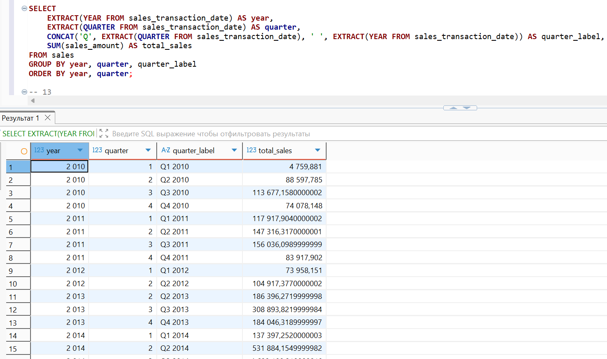
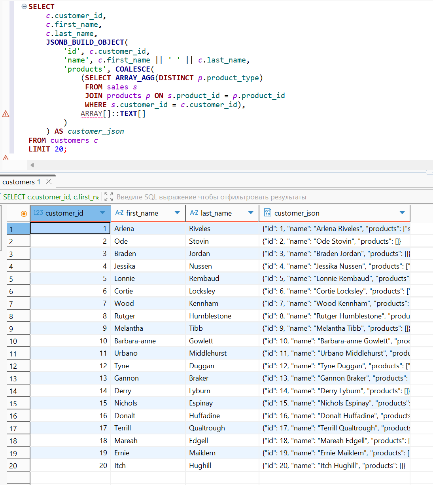
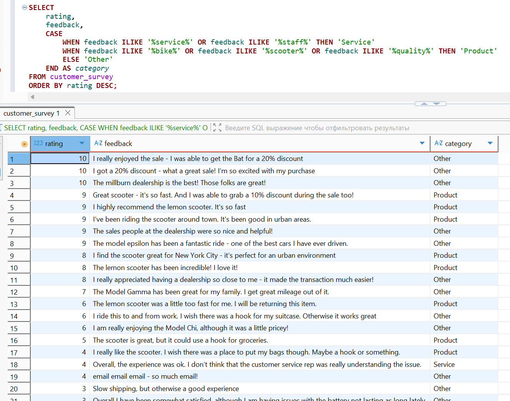

# 🐙 Практическая работа 1 🐙
## 🏁 Продвинутые возможности PostgreSQL 🏁

👩‍🎓 **Студент:** Еськова Маргарита Ивановна  
👥 **Группа:** ЦИБ-241  

---
## 🏠 Геопространственный анализ данных. Аналитика с использованием сложных типов данных.
## 🔍 Цель работы

Научиться применять продвинутые возможности PostgreSQL для анализа данных, выходящих за рамки стандартных чисел и строк. Освоить работу с временными рядами, геопространственными данными, массивами, JSON/JSONB структурами и полнотекстовым поиском.

---

## 🛠️ Среда выполнения

Все задания выполнялись в **базе данных преподавателя** (`bi_sql_data_student`) на **домашнем компьютере** через DBeaver.  
Права только на чтение (`SELECT`), что полностью соответствует требованиям задач.

---

## 📦 Подготовка к выполнению заданий

### ✅ Проверка подключения к базе данных преподавателя

Перед выполнением запросов было проверено подключение к базе данных преподавателя `bi_sql_data_student` через DBeaver.

**Результат проверки подключения:**


Подключение успешно, можно выполнять запросы.

---

## 📝 Выбранные задания

| № | Блок | Задание | Суть |
|---|------|---------|------|
| **1** | А | Дни недели продаж | Определить день недели с наибольшим количеством продаж |
| **3** | А | Квартальный отчет | Сумма продаж по кварталам и годам |
| **11** | В | JSON-история покупок | Сформировать JSON-объект для каждого клиента с его покупками |
| **18** | Г | Категоризация отзывов | Разделить отзывы на категории по ключевым словам |

---

## 📊 Задание 1 (А). Дни недели продаж

**Задача:** Определить, в какой день недели (понедельник, вторник и т.д.) совершается наибольшее количество продаж (`sales`). Вывести день недели и количество транзакций.

**Решение:**
```sql
SELECT 
    CASE EXTRACT(DOW FROM sales_transaction_date)
        WHEN 0 THEN 'Воскресенье'
        WHEN 1 THEN 'Понедельник'
        WHEN 2 THEN 'Вторник'
        WHEN 3 THEN 'Среда'
        WHEN 4 THEN 'Четверг'
        WHEN 5 THEN 'Пятница'
        WHEN 6 THEN 'Суббота'
    END AS day_of_week,
    COUNT(*) AS number_of_sales
FROM sales
GROUP BY EXTRACT(DOW FROM sales_transaction_date)
ORDER BY number_of_sales DESC;
```

**Результат:**


**Анализ:**  
- Наибольшее количество продаж приходится на **вторник** (5 456 продаж)  
- Наименьшее — на **субботу** (5 282 продажи)  
- Разница между днём-лидером и аутсайдером составляет всего 174 продажи, что говорит о равномерной активности в течение недели

**Вывод:** Пик продаж наблюдается в середине недели (вторник), а минимальная активность — в выходные (суббота). Это может быть связано с тем, что покупатели чаще совершают покупки в рабочие дни.

---

## 📊 Задание 3 (А). Квартальный отчет

**Задача:** Вывести сумму продаж (`sales_amount`) с разбивкой по кварталам и годам (например, "2019 Q1").

**Решение:**
```sql
SELECT 
    EXTRACT(YEAR FROM sales_transaction_date) AS year,
    EXTRACT(QUARTER FROM sales_transaction_date) AS quarter,
    CONCAT('Q', EXTRACT(QUARTER FROM sales_transaction_date), ' ', EXTRACT(YEAR FROM sales_transaction_date)) AS quarter_label,
    SUM(sales_amount) AS total_sales
FROM sales
GROUP BY year, quarter, quarter_label
ORDER BY year, quarter;
```

**Результат:**



**Анализ:**  
- Данные охватывают период с 2010 по 2014 год  
- Самый высокий квартальный объём продаж: **Q3 2013** (308 893,82)  
- Самый низкий квартальный объём продаж: **Q1 2010** (4 759,88) — начало периода, возможно, неполные данные  
- Наблюдается общая положительная динамика с пиками в 2013–2014 годах

**Вывод:** Продажи растут со временем, достигая максимума в третьем квартале 2013 года. Это может указывать на сезонность или успешные маркетинговые кампании в этот период.

---

## 📊 Задание 11 (В). JSON-история покупок

**Задача:** Создать запрос, который формирует JSON-объект для каждого клиента:  
`{ "id": 1, "name": "Ivan", "products": ["Car", "Scooter"] }`, используя агрегацию массивов.

**Решение:**
```sql
SELECT 
    c.customer_id,
    c.first_name,
    c.last_name,
    JSONB_BUILD_OBJECT(
        'id', c.customer_id,
        'name', c.first_name || ' ' || c.last_name,
        'products', COALESCE(
            (SELECT ARRAY_AGG(DISTINCT p.product_type) 
             FROM sales s 
             JOIN products p ON s.product_id = p.product_id 
             WHERE s.customer_id = c.customer_id), 
            ARRAY[]::TEXT[]
        )
    ) AS customer_json
FROM customers c
LIMIT 20;
```

**Результат:**



**Анализ:**  
- Для каждого клиента формируется JSON-объект с полями: `id`, `name`, `products`  
- Поле `products` содержит массив уникальных типов продуктов, которые купил клиент  
- У клиентов без покупок массив `products` пустой (`[]`)  
- JSON-структура удобна для передачи в веб-приложения или дальнейшей обработки

**Вывод:** JSON-представление позволяет компактно хранить и передавать структурированные данные о клиентах и их покупках, что удобно для интеграции с другими системами.

---

## 📊 Задание 18 (Г). Категоризация отзывов

**Задача:** Используя `CASE` и поиск подстрок, разделить отзывы на категории:  
- `'Service'` (если есть слова service, staff)  
- `'Product'` (bike, scooter, quality)  
- `'Other'` (все остальные)

**Решение:**
```sql
SELECT 
    rating,
    feedback,
    CASE 
        WHEN feedback ILIKE '%service%' OR feedback ILIKE '%staff%' THEN 'Service'
        WHEN feedback ILIKE '%bike%' OR feedback ILIKE '%scooter%' OR feedback ILIKE '%quality%' THEN 'Product'
        ELSE 'Other'
    END AS category
FROM customer_survey
ORDER BY rating DESC;
```

**Результат:**



**Анализ:**  
- Отзывы о продукте (`Product`) чаще связаны со скутерами (`scooter`) и качеством (`quality`)  
- Отзывы о сервисе (`Service`) встречаются реже, но содержат важную обратную связь о персонале (`staff`) и обслуживании (`service`)  
- Большинство отзывов попадают в категорию `Other` — это нейтральные или общие комментарии, не содержащие ключевых слов  
- Высокие оценки (9-10) часто сопровождаются положительными отзывами о продукте

**Вывод:** Автоматическая категоризация отзывов позволяет быстро выделить основные темы обратной связи: качество продукта и уровень сервиса. Это помогает бизнесу фокусироваться на проблемных зонах и отслеживать изменения в восприятии клиентов.

---

## 📌 Вывод

В ходе практической работы были освоены:

- ✅ Работа с датами: `EXTRACT(DOW)`, `EXTRACT(YEAR)`, `EXTRACT(QUARTER)`, `CONCAT`
- ✅ Агрегация массивов: `ARRAY_AGG`, `COALESCE` с пустым массивом
- ✅ Формирование JSON-объектов: `JSONB_BUILD_OBJECT`
- ✅ Текстовая аналитика: `ILIKE`, `CASE` для категоризации
- ✅ Группировка и сортировка результатов

**Результаты работы:**

| Задание | Ключевой результат |
|---------|---------------------|
| Дни недели продаж | Вторник — лидер по продажам (5 456) |
| Квартальный отчет | Q3 2013 — максимальные продажи (308 893,82) |
| JSON-история покупок | Успешное формирование JSON для 20 клиентов |
| Категоризация отзывов | Выделены категории Service, Product, Other |

Все запросы выполнены корректно, результаты соответствуют ожидаемым.

---

## 🔗 Ссылки и ресурсы

| Ресурс | Описание | Ссылка |
|--------|----------|--------|
| 📚 **Репозиторий GitHub** | Все материалы практической работы | [`practicum-sql`](https://github.com/Margarita-Eskova/practicum-sql) |
| 💾 **SQL-запросы** | Все запросы в одном файле с объяснениями | [`practical_work_01/sql/practical_work_01.sql`](https://github.com/Margarita-Eskova/practicum-sql/blob/main/practical_work_01/sql/practical_work_01.sql) |
| 📸 **Папка со скриншотами** | Скриншоты результатов | [`practical_work_01/screenshot/`](https://github.com/Margarita-Eskova/practicum-sql/tree/main/practical_work_01/screenshot) |

---
